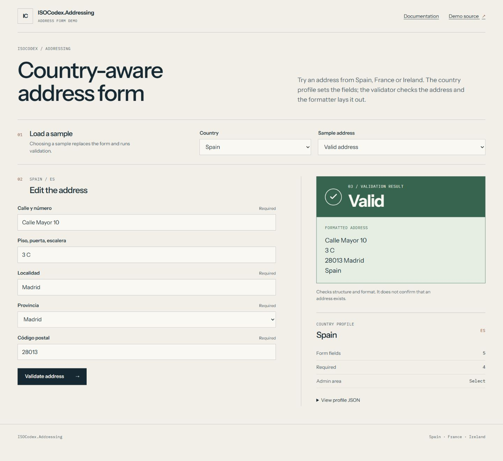
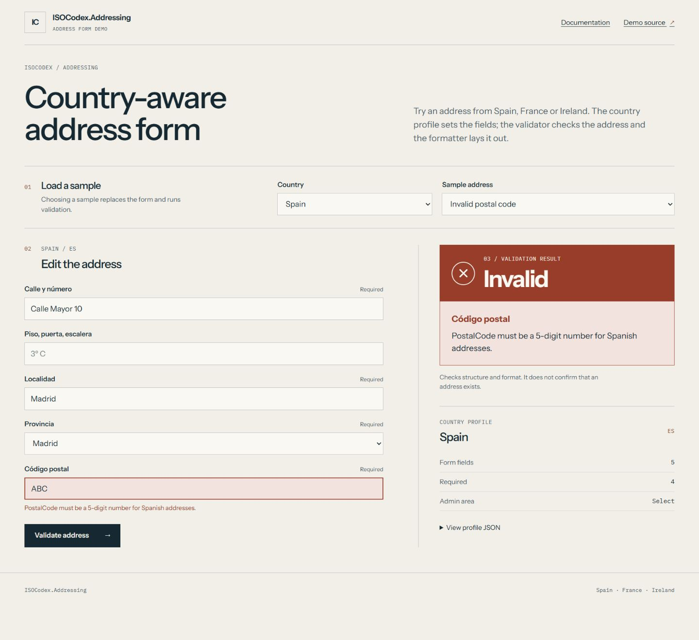

# ISOCodex.Addressing

Country-aware postal address models, validation, formatting and address-entry profiles for .NET.

This repository contains public documentation, runnable examples and the consumer issue tracker. The library implementation and development history are maintained in a separate private repository. Install the published packages from NuGet; clone this repository to run the examples against published NuGet packages.

## Try it locally

With the .NET 10 SDK installed, clone this public repository and run:

```powershell
git clone https://github.com/AnthonyPWatts/ISOCodex.Addressing.Docs.git
cd ISOCodex.Addressing.Docs
dotnet run --project samples/DynamicAddressFormDemo --no-launch-profile --urls http://localhost:5001
```

[Browse all runnable examples](samples/README.md). They use published NuGet packages and need no private repository access.

Open [the address form](http://localhost:5001/?CountryCode=ES&SampleId=es-valid) and switch between the supplied scenarios.

## Install

Current release: **2.1.1**. [View on NuGet](https://www.nuget.org/packages/ISOCodex.Addressing/2.1.1).

```powershell
dotnet add package ISOCodex.Addressing --version 2.1.1
```

## What it provides

- Shared country identity from ISOCodex.Countries.
- Structured validation issues, country-specific formatting and form metadata.
- Country packs for Brazil, Canada, France, Germany, Great Britain, India, Ireland, Italy, Mexico, Spain and the United States.
- Validation of documented address rules; no claim of delivery verification.

## Documentation

- [Consumer guide](docs/usage.md)
- [Framework compatibility and verification](docs/compatibility.md)
- [Release notes](CHANGELOG.md)
- [Questions, bug reports and feature requests](https://github.com/AnthonyPWatts/ISOCodex.Addressing.Docs/issues)
- [Discussion](https://github.com/AnthonyPWatts/ISOCodex.Addressing.Docs/discussions)

- [Countries documentation](https://github.com/AnthonyPWatts/ISOCodex.Countries.Docs)
- [Currency documentation](https://github.com/AnthonyPWatts/ISOCodex.Currency.Docs)

## Address-entry example

The [runnable address-form demo](samples/DynamicAddressFormDemo/README.md) uses published NuGet packages to build a country-aware form.





## Feedback

Include package versions, target framework, expected behaviour and a small reproducible consumer example when reporting a problem. Data corrections should include a reliable source and the date checked.

## Licence and source availability

The documentation and sample applications are provided under the [MIT licence](LICENSE). Published packages retain their declared licences. Private source hosting does not revoke rights already granted for earlier distributions. ISOCodex is not an official ISO product or endorsed by ISO.
